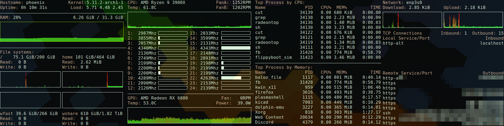

# aux-display

I picked up a few of the Taiwanese made HSD088IPW1 displays and thought they'd make a good auxiliary display for system status.  Indeed they are pretty good at it, but here's some notes:

- Display is 8bpc 60Hz only
- Display is internally organized as a 480x1920 portrait display so you'll want to set ``video=HDMI-A-1:panel_orientation=right_side_up`` as appropriate for your HDMI port number to inform the kernel framebuffer and things like Plymouth about the rotation pre-X
- Conky doesn't do columns particularly well, so my solution was to run 4 instances
- The monitor mount is just simple thing held in place via friction from some foam strips. It actually is quite secure given the tolerances. You'll certainly want to adjust the model, which is not parametric.

The conky configs are named by their relative position left to right on the display (i.e. conkyl.conf, conkylm.conf, conkyrm.conf, conkyr.conf)

